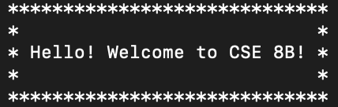
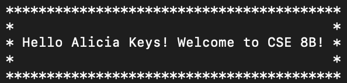
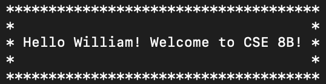
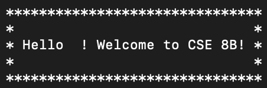
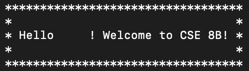

# PA1: Review from CSE 8A - Due Tuesday, January 14, 2020

## Welcome to CSE 8B!

The purpose of this assignment will be to set up a development environment to use for the remainder of the quarter as well as refresh yourself with CSE 8A concepts.

### Policies and expectations

1. In this course, we will have a programming assignment, mostly programming, each week. Requirements for these assignments will be in "writeups", such as this one. If there is ever a discrepancy between provided files and the writeup, follow the writeup.
2. We will use [Piazza](https://piazza.com/class 'Piazza homepage') for announcements and clarifications. Although it is not required that you read every post, you are expected to check it for important information such as due dates, revised starter files, etc.
3. Before asking a question on Piazza, try to do a search for it using the search bar. For duplicate questions, we will follow the precedent set by the previous instructor answer; in the case of an inconsistency between Piazza answers to the same question or between a Piazza answer and the writeup, please ask for clarification (in a new post for a faster response).
4. Do not pretend to be an instructor. Instructors are not able to post anonymously. Furthermore, note that a student may have a badge indicating that they are an instructor-endorsed answerer. This does not mean anything; unless the student answer is marked as a good question by an instructor, we have not endorsed it.
5. Do not post code in public posts. This is a violation of academic integrity. If you accidentally do this, make all efforts to remove the code and ask the instructor to make the post private.
6. Follow academic integrity. Do not use a solution that you find on the internet. Looking up documentation, syntax, or an example for how to use some function is allowed. On the flipside, do not post your code for this class to the internet. If you are using GitHub or a similar service, make sure your code is in a private repository. You can do this for free with the [GitHub education pack](https://education.github.com/pack 'GitHub education pack website').
7. Do not use any libraries that are not java.lang or java.util unless explicitly allowed (if you are not sure, you can ask on Piazza in a public post). Similarly, do not use any libraries or functions that are explicitly disallowed.
8. Assignments will be submitted via [Gradescope](https://www.gradescope.com/ 'Gradescope homepage'). Exam grades will also be released via Gradescope.
9. Only use the regrade request functionality if you believe a rubric item was incorrectly applied or there is a mistake in the rubric. If you submit a regrade request, we will regrade some undefined portion of the assignment (so if we incorrectly awarded points the first time, you may not be awarded those points again).
10. If you are asking for clarification about some rubric item but not requesting a regrade (yet), please ask via a Piazza private post. As long as you submit this post before the regrade deadline ends, we will still regrade the assignment after the regrade period ends, if needed.
11. Your code will be graded as it works on ieng6, therefore you should always test your code on ieng6 prior to submission.
12. Tutor hours will be posted on the course calendar. If your ticket is still in the [Autograder](https://autograder.ucsd.edu/ 'Autograder homepage') queue after tutor hours are over, the tutor(s) may not be able to help you.
13. If you need to leave the location specified in your Autograder ticket, please write when you will be back in the comments of the ticket. If you are not there at the time the ticket is accepted, the tutor may either return your ticket to the queue as a low-priority ticket or cancel the ticket if you do not leave a comment.
14. Make sure you've read [Grading Policies](https://sites.google.com/eng.ucsd.edu/cse8b-winter2020/syllabus/grading-policies) on how we grade and all of the pages on the [syllabus](https://sites.google.com/eng.ucsd.edu/cse8b-winter2020/syllabus).

### Programming Requirements for CSE 8B

The Java code you submit in the programming assignments must compile and run on Java 10 on Linux. If you use the lab machines in the CSE building, then you should be using the correct programming language version and the correct operating system version by default. We'll confirm the compiler version as part of this assignment. In-lab and remote programmers will use the correct compiler and operating system by default, since your connection allows you access to data and programs on the lab machines. Local programmers have additional problems and must check their Java programs against ieng6.
To earn credit, your Java code must be for

- Programming Language: Java 10
- Operating System: Linux/UNIX
  For example, if you use Java for Windows and a program produces a file that has the wrong formatting, which is possible, points will be lost and that case is not eligible for regrades. This is why programs must be checked against the ieng6 servers.
  
### A Note on Style

Please refer to these [style guidelines](https://sites.google.com/eng.ucsd.edu/cse8b-winter2020/style-guide) when working on the assignments.  
Points for style will not be deducted for PA1. Starting from PA2, style will be part of your overall assignment grade. However, we expect that you try to follow the style guidelines for this PA1 because it is good practice. We will provide you with feedback in your grade report on what can be improved in terms of style and what is good.

## Part 1. Academic Integrity Tutorial and Form

**TO DO:** you are **required** to sign the Academic Integrity Form electronically after completing the [Academic Integrity Tutorial](http://libraries.ucsd.edu/assets/elearning/cse/cseplagiarismlink/story_html5.html 'AI Tutorial Link'). The form can be found [here](https://docs.google.com/forms/d/e/1FAIpQLSd_MyRyWcwDKB6K_uXSBYjzFun0T0ffL21ObzM386qfB6cpHQ/viewform 'CSE 8B AI Form').

## Part 2. Surveys
Please fill out the following 2 surveys as each one will be worth 1 point among your overall PA1 score.
* Degree plans for CSE students: [here](https://docs.google.com/forms/d/e/1FAIpQLSe_A_4a1UImg8MOm3FVYpWkL4deVBmH4_uzIO7TpSeN1Mr8lg/viewform)  
* Pre-class survey: [here](https://forms.gle/TdE7MZG5amABSL997)  

## Part 3. Environment Setup

Please read the [environment-setup.md](https://github.com/CaoAssignments/cse8b-wi20-pa1-review-starter/blob/master/environment-setup.md) document that details how to access a development environment through the lab machines or remotely as well as setup a local development environment on your laptop. As a way to ensure you have access to a proper environment for the rest of the quarter (either through the lab computers or through your own computer), please compile and execute the `Test.java` file, which should open up a popup window indicating that your development environment has been set up correctly.  
**TO DO:** set up or get access to a correct development environment as stated in environment-setup.md. IMPORTANTLY, ensure that X11 forwarding is enabled if accessing the environment remotely, otherwise the popup window will not be displayed. Compile and execute `Test.java`. Screenshot the popup window (containing a special message) that opens from compiling and executing the `Test.java` file as proof that you have access to a development environment. Name this screenshot file exactly as `environment-setup.png` otherwise no credit for this section will be given. Put this screenshot file in the same folder where your `Test.java` file is located.  
**Note:** we have provided you with a `vimrc` file in the starter code that can be used if you decide to use Vim as your preferred text editor for the assignment.

## Part 4. Java Exercises

**TO DO:** you will complete 4 exercises that cover what you have learned in CSE 8A. Please work within the starter code file PA1.java and only add code where it specifically tells you to.

### Exercise 1. Printing the ASCII Values of Characters

In this exercise, you will write the `printASCIIValues(String input)` method. This method should print out the ASCII integer value of each character in the `String input` argument next to the actual character value.  Assume that `input` will always be valid and not null.  
For example, let's say `printASCIIValues("Java")` is called. 'J' has an ASCII value of 74, 'a' has an ASCII value of 97, 'v' has an ASCII value of 118, and 'a' has an ASCII value of 97. The following would be printed:  
`J 74`  
`a 97`  
`v 118`  
`a 97`  
Ensure that the output is printed exactly as it is above - `<character><space><ASCII value>`. The method should be case sensitive as capital and lowercase versions of a same letter have different ASCII values.

### Exercise 2. Rotating a 1-Dimensional Array

In this exercise, you will write the `rotate1DArray(int[] input, int rotations)` method. This method should return a one-dimensional int array that represents the rotated version of the `input` array argument. The number of rotations to perform depends on the `rotations` argument and each rotation will be done in the right direction. Assume that `input` will always be valid and not null.  
**Example input array:**  
_1, 2, 3, 4, 5_

- Rotation value of 0 or 5:  
  _1, 2, 3, 4, 5_
- Rotation value is 1:  
  _5, 1, 2, 3, 4_
- Rotation value is 4:  
  _2, 3, 4, 5, 1_
- Rotation value is 6:  
  _5, 1, 2, 3, 4_ because a rotation value of 6 does the same exact thing as a rotation value of 1 given our input array of length 5 (think about the `6 % <length of the array>` operation)
- Rotation value is -1:  
  _2, 3, 4, 5, 1_ because a rotation value of -1 (1 rotation to the left instead of right) does the same exact thing as a rotation value of 4 to the right given our input array of length 5
- Rotation value is -14:  
  _5, 1, 2, 3, 4_ because a rotation value of -14 does the same exact thing as a rotation value of 1 given our input array of length 5 (think about the `-14 % <length of the array>` operation)

### Exercise 3. Rotating a 2-Dimensional Array

In this exercise, you will write the `rotate2DArray(int[][] input, int rotations, boolean rotateRows)` method. This method should return a two-dimensional int array that represents the rotated version of the `input` 2D-array argument. The number of rotations to perform depends on the `rotations` argument, each row rotation will be done in the downwards direction, and each column rotation will be done in the right direction. If the `rotateRows` value is true, then rotate the rows of the 2D `input` array. If false, rotate the columns of the 2D `input` array. Assume that `input` will always be valid and not null.  
**Tip:** try using the `rotate1DArray(int[] input, int rotations)` method when `rotateRows` is false to avoid rewriting code.

**Example input array:**  
_1, 2, 3_  
_4, 5, 6_  
_7, 8, 9_

- Rotation value is 1 and rotateRows is true:  
  _7, 8, 9_  
  _1, 2, 3_  
  _4, 5, 6_
- Rotation value is either 0 or 3 and rotateRows is true:  
  _1, 2, 3_  
  _4, 5, 6_  
  _7, 8, 9_
- Rotation value is 7 and rotateRows is true:  
  _7, 8, 9_  
  _1, 2, 3_  
  _4, 5, 6_
- Rotation value is -1 and rotateRows is true:  
  _4, 5, 6_  
  _7, 8, 9_  
  _1, 2, 3_
- Rotation value is -4 and rotateRows is true:  
  _4, 5, 6_  
  _7, 8, 9_  
  _1, 2, 3_
- Rotation value is 1 and rotateRows is false:  
  _3, 1, 2_  
  _6, 4, 5_  
  _9, 7, 8_
- Rotation value is either 0 or 3 and rotateRows is false:  
  _1, 2, 3_  
  _4, 5, 6_  
  _7, 8, 9_
- Rotation value is 4 and rotateRows is false:  
  _3, 1, 2_  
  _6, 4, 5_  
  _9, 7, 8_
- Rotation value is -1 and rotateRows is false:  
  _2, 3, 1_  
  _5, 6, 4_  
  _8, 9, 7_
- Rotation value is -4 and rotateRows is false:  
  _2, 3, 1_  
  _5, 6, 4_  
  _8, 9, 7_

### Exercise 4. Printing Introductions

In this exercise, you will write the `printIntroduction(String name)` method. This method takes as input a String called `name`, where you may assume `name` can be a maximum of 30 characters and can only consist of spaces/uppercase letters/lowercase letters. `name` can also be null or an empty String. This method should print out 5 lines where: the 1st and 5th lines contain just asterisks; the 2nd and 4th lines start with an asterisk, followed by space characters, and end with an asterisk; and the 3rd line starts with an asterisk, followed by a space character, then followed by the message "Hello `<name>`! Welcome to CSE 8B!", then followed a space character, and ends with an asterisk. All 5 lines should contain the same number of characters, so the 3rd line (line that contains the message) defines the length of the rest of the lines. If the `name` argument is null or is an empty String (""), then the message will simply be printed without a name (see **Example 1** below).

- **Example 1:** If `name` is null or is an empty String (""), the output will be:  
  
- **Example 2:** If `name` is "Alicia Keys", then the output will be:  
  
- **Example 3:** If `name` is "William", then the output will be:  
  
- **Example 4:** If `name` is "&nbsp;" (1 space character), then the output will be:  
  
- **Example 5:** If `name` is "&nbsp;&nbsp;&nbsp;&nbsp;" (4 space characters), then the output will be:  
  

## Part 5. Weekly Reflection
Please fill out a weekly reflection survey [here](https://forms.gle/Nw1ZmUD2J88zui6q7)

## Files to Submit to Gradescope

- PA1.java
- environment-setup.png
