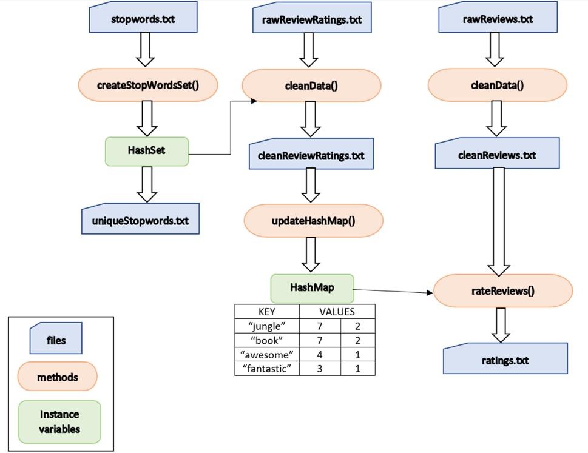

# PA 7: Collections

## Assignment Overview
**Due date: Thursday, February 27 @ 11:59PM**

The objective of this assignment is to test your understanding of Collections. You will learn to work with ArrayLists, HashMaps and HashSets primarily. In this assignment, you will be implementing a version of the bag of words model used in Machine Learning. You will create a program that will be able to make a prediction of the ratings of movie reviews based on some learning it did beforehand using some reviews that already had ratings associated with them. Although it is one of the very basic primitive models, it gives you an introduction to the world of Machine Learning. 

In this assignment you’ll be doing the following:
- Read a raw text file containing movie reviews and ratings. 
- Read a file containing stopwords and create a HashSet which will be used for cleaning the data.
- Clean the data. (For example: Remove the punctuations and stopwords (e.g. is, and, the, etc.) from the reviews) and write the contents to a clean review file.
- Create a HashMap which associates a word from the cleaned file to values which represent the total rating and the count of the word in the given file. 
- Use the HashMap between the words and their associated values and rate reviews from another file that doesn’t have any rating already.
- Write the ratings of the reviews to an output file.

You are allowed to use built-in packages for this PA.

## Know your data

You have been given the following input files for small data and big data. 

### Small Data Input Files:
- Rated Review File: `rawReviewRatings.txt`
- Unrated Review File: `rawReviews.txt`

### Big Data Input Files:
- Rated Review File: `rawReviewRatingsBig.txt`
- Unrated Review File: `rawReviewsBig.txt`

### Stop words Input File:
- Stopwords File: `stopwords.txt`

A brief description of what each file contains:

#### - `rawReviewRatings.txt` 
The raw data with the reviews and the rating will be present in a file named `rawReviewRatings.txt`. Every review is given a rating between 0 - 4 (both inclusive). The following are interpretation of the rating values:  
0 = Negative  
1 = Somewhat Negative  
2 = Neutral  
3 = Somewhat Positive  
4 = Positive  
Each line of review follows the following format:  
<rating> <review>  

Example:  
4 The Jungle Book is awesome!  
where 4 is the rating and the text “The Jungle Book is awesome!” is the review.  

#### - `rawReviews.txt` 
The raw data with only the reviews will be present in a file named `rawReviews.txt`. Your task is to predict the ratings for each of the reviews in this file.   

Example:  
The Jungle Book is awesome!  

#### - `rawReviewRatingsBig.txt` 
A file structured similar to `rawReviewRatings.txt` but it has more number of reviews and rating pairs (basically a bigger dataset).

#### - `rawReviewsBig.txt` 
A file structured similar to `rawReviews.txt` but it has more number of reviews (basically a bigger dataset) for which you need to predict the ratings. 

#### - `stopwords.txt` 
You have also been given a file called `stopwords.txt` which will contain all the stop words that you will need to filter out from your data as part of the process of cleaning the data. You will do this by creating a HashSet of stop words read from this file and using the set to filter out the stop words from the reviews.

Go through the files once to get an idea of how your data is structured.

## RatingPredictor.java

You are expected to create a class called `RatingPredictor.java` for this assignment. 

### Instance variables:

You should have the following instance variables in your class:  

#### - `private HashMap<String, int[]> wordFreqMap`   

This will be the hashmap in which you will store a string as your key and an integer array as the value. The string represents a word in the review. The first element in the integer array should hold the sum of the ratings of the reviews of which the word is a part of and the second element in the integer array should hold the count for the word (the number of times the word appears in the reviews altogether)   

Example:   
If the cleaned file contained only these two reviews:    
4 jungle book awesome  
3 jungle book fantastic  

The HashMap `wordFreqMap` should contain these key-value pairs: 
|Key|Values|
|---|---| 
|jungle|[7,2]|   
|book|[7,2]| 
|awesome|[4,1]|  
|fantastic|[3,1]|    

The word 'jungle' appears two times and the corresponding ratings are added up (4+3=7) to give the total rating and 2 is the number of the times the word appears in all of the reviews combined.

#### - `private HashSet<String> stopWords`  

This will be the hashset that stores all of the stopwords read from the `stopwords.txt` file.   

### Constructor:

#### - `public RatingPredictor()` 

Use this non-parameterized constructor to initialize the instance variables.

### Methods to clean the data:

You need to have the following methods in your class which will be used to clean the data. In each of the following methods which help in cleaning data, if the input parameter is null or of length 0, then return `null`.     

#### - `public ArrayList<String> splitLine (String sentence)`  

This method takes in a String as a parameter. The String will contain the entire contents of one review and this method should split it into words and return an ArrayList of words.  

Example:  

input --> The Jungle-Book is a fantastic movie! It's the best!!   
output --> ("The", "Jungle-Book", "is", "a", "fantastic", "movie!", "It's", "the", "best!!") 

#### - `public ArrayList<String> splitAtHyphensAndQuotes (ArrayList<String> words)` 

This methods takes in an ArrayList of words and splits the words in the ArrayList at the hyphens and single quotes and return a modified ArrayList of words. 
 
Example:   

input --> ("The", "Jungle-Book", "is", "a", "fantastic", "movie!", "It's", "the", "best!!")   
output --> ("The", "Jungle", "Book", "is", "a", "fantastic", "movie!", "It", "s", "the", "best!!")    

#### - `public ArrayList<String> removePunctuation (ArrayList<String> words)`   
 
This method should remove all the punctuation from the ArrayList of words and return a modified ArrayList of words. The following characters are considered as punctuations: ``!"#$%&'()*+,-./:;<=>?@[\]^_`{|}~``  

Example:   

input --> ("The", "Jungle", "Book", "is", "a", "fantastic", "movie!", "It", "s", "the", "best!!")  
output --> ("The", "Jungle", "Book", "is", "a", "fantastic", "movie", "It", "s", "the", "best")  

#### - `public ArrayList<String> removeWhiteSpaces (ArrayList<String> words)`
  
This method should remove all the leading and trailing white spaces from the ArrayList of words and return a modified ArrayList of words.   

Example:   

input --> ("The", "Jungle", "Book    ", "is", "a", "    fantastic", "movie", "  It", "s", "the  ", "best")   
output --> ("The", "Jungle", "Book", "is", "a", "fantastic", "movie", "It", "s", "the", "best")   

#### - `public ArrayList<String> removeEmptyWords (ArrayList<String> words)`  

This method should remove all empty words from the ArrayList of words and return a modified ArrayList of words.  

Example:   

input --> ("The", "Jungle", "Book", "", "", "fantastic", "movie", "It", "s", "", "best")   
output --> ("The", "Jungle", "Book", "fantastic", "movie", "It", "s", "best") 

#### - `public ArrayList<String> removeSingleLetterWords (ArrayList<String> words)`   

This method should remove all single letter words from the ArrayList of words and return a modified ArrayList of words.   

Example:    

input --> ("The", "Jungle", "Book", "is", "a", "fantastic", "movie", "It", "s", "the", "best")     
output --> ("The", "Jungle", "Book", "is", "fantastic", "movie", "It", "the", "best")   

#### - `public ArrayList<String> toLowerCase (ArrayList<String> words)`  

This method should make all the words in the ArrayList to lower case and return a modified ArrayList of words.   

Example:     

input --> ("The", "Jungle", "Book", "is", "fantastic", "movie", "It", "the", "best")     
output --> ("the", "jungle", "book", "is", "fantastic", "movie", "it", "the", "best")   

#### - `public ArrayList<String> removeStopWords (ArrayList<String> arrList)`

This method should remove all the stop words in the ArrayList and return a modified ArrayList of words. You need to create a HashSet from the given `stopwords.txt` file and then use the HashSet to filter out those stop words from the given ArrayList.  

Example:     

input --> ("the", "jungle", "book", "is", "fantastic", "movie", "it", "the", "best")       
output --> ("jungle", "book", "fantastic", "movie", "best")      

### Methods to help with the rating prediction task:

#### - `public void createStopWordsSet (String inFile, String outFile)`  

Read the `stopwords.txt` as the input file (inFile) and create a HashSet of stop words and also output the HashSet into an output file (outFile) called `uniqueStopwords.txt`. This output file should contain one stop word in each line and should not have any duplicate stop words.  

#### - `public void cleanData (String inFile, String outFile, boolean ratingIncluded)`   

This method should read a raw input file and output a cleaned data file:
For example:
| Input File Name | Output File Name |
| --------------- | ---------------- |
| `rawReviewRatings.txt` | `cleanReviewRatings.txt` |
| `rawReviews.txt` | `cleanReviews.txt` |
| `rawReviewRatingsBig.txt` | `cleanReviewRatingsBig.txt` |
| `rawReviewsBig.txt` | `cleanReviewsBig.txt` |

You can read in the reviews line by line and call in the methods for cleaning the data one after the other which were described above. Make sure you call the functions for cleaning the data in this order: 
1. splitLine() 
2. splitAtHyphensAndQuotes()
3. removePunctuation()
4. removeWhiteSpaces()
5. removeEmptyWords() 
6. removeSingleLetterWords()
7. toLowerCase()
8. removeStopWords()   

The cleaned files should have the same structure as the input files i.e; if the file had ratings followed by review then your output file should also have rating followed by cleaned review. If the input file has only reviews then the output file should have only cleaned reviews. The boolean flag ratingIncluded can be used to differentiate between files that have rating and reviews (ratingIncluded = true) and files that have only reviews (ratingIncluded = false).   

For example:   

If the input file `rawReviewRatings.txt` file contains:   
4 The Jungle Book is awesome!  
2 "The Lion King" is awe-inspiring !   
0 Jack and Jill is worst!   
1 " Finding Dory" is good .   
3 Zootopia    is fantastic.   
4 Jungle Book is fantastic.   
3 Lion King is fantastic.   

Then the output file `cleanReviewRatings.txt` file should contain:   
4 jungle book awesome   
2 lion king awe inspiring    
0 jack jill worst    
1 finding dory good    
3 zootopia fantastic   
4 jungle book fantastic    
3 lion king fantastic    

#### - `public void updateHashMap(String inCleanFile)`   

This method should take in the cleaned data file as the input and use it to update the HashMap as explained before in the instance variable section.

For example: The HashMap for the above cleaned data file `cleanReviewRatings.txt` should be as follows:
|Key|Values|
|---|---| 
|king|[5, 2]|
|book|[8, 2]|
|inspiring|[2, 1]|
|finding|[1, 1]|
|good|[1, 1]|
|lion|[5, 2]|
|awe|[2, 1]|
|jack|[0, 1]|
|jill|[0, 1]|
|zootopia|[3, 1]|
|awesome|[4, 1]|
|fantastic|[10, 3]|
|worst|[0, 1]|
|jungle|[8, 2]|
|dory|[1, 1]|  
 
#### - `public void rateReviews (String inCleanFile, String outRatingsFile)`   

For this, first you should have already cleaned the file with only reviews given to you. Once you have the cleaned file (for example: cleaned data file is `cleanReviews.txt` for the given raw review file i.e; `rawReviews.txt`), you will predict the ratings for the reviews given in this cleaned file. Using the HashMap that you created in the previous step, you are going to read new unrated reviews from a cleaned file (e.g. `cleanReviews.txt`) and predict a rating for each review in this file. The predicted rating for each review is written to an output file named `ratings.txt`.    

How do we predict the ratings for the unrated reviews?     

- Rate each review by finding the rating for each word from the HashMap that was updated previously. The rating for a line of review is the average value of the rating of all the words in the review. If some word in this unrated review is not found in the HashMap, then that word is given a neutral rating of 2. If a review is empty (i.e. the review contains no words in it), then such a review is also given a neutral rating of 2.  

e.g. Let see how we computed the rating for the 2nd review in `cleanReviews.txt` (i.e. “lion king fantastic”). We lookup the HashMap that we created before (in the `updateHashMap` method description) and get the average rating for each word in this review. The average ratings of each word in this review is shown below:   

lion: 5/2 = 2.5   
king: 5/2 = 2.5  
fantastic: 10/3 = 3.3333333  

Rating for this line = (2.5 + 2.5 + 3.3333333) / 3 = 2.7777777    
After rounding up, Rating for this line = 2.8      
(We are dividing by 3 since this review contains 3 words in total)        

Based on these individual values, this line gets an average review of 2.7 which will be written in the `ratings.txt` file. Make sure to use floating point division instead of integer division since the decimal points will be truncated in the latter. Also, once you get the final rating for a particular review, round it to just one decimal place (do not simply truncate). For example, in this above example, the floating point division would give 2.7777777, but you need to round this upto one decimal place into your `ratings.txt` file which will be 2.8 after rounding off. Also, if the final rating you get is 2 then make sure your value is 2.0 in the output file.     

Another example: “finding nemo great”  
finding: 1  
nemo: 2 (because it is NOT found in the HashMap)  
great: 2 (because it is also NOT found in the HashMap)  

Rating for this line = (1 + 2 + 2) / 3 = 1.6666667    
After rounding up, Rating for this line = 1.7       

Write the corresponding ratings for all the reviews to an output file named `ratings.txt`.   

For example, You have been given a file called `rawReviews.txt`. For this file, after cleaning the data and predicting the ratings should give the following result:   
|`rawReviews.txt`|`cleanReviews.txt`|`ratings.txt`|
|---|---|---| 
|I like "The Jungle Book".|like jungle book|3.3|
|The Lion King is fantastic !|lion king fantastic|2.8|
|Jack and Jill is bad.|jack jill bad|0.7|
|Finding Nemo is great!|finding nemo great|1.7|
|Zootopia is awesome !|zootopia awesome|3.5|   
 
 
## Testing
You can test your code on the given small dataset first and then move on to testing your code on the given bigger dataset. For testing your code, create an object of the RatingPredictor class and call various methods on it. Another important point to remember is when you generate the output files, make sure you create the files in the same folder as the RatingPredictor class. We will be testing your code on another unseen bigger dataset, thus do not try to hard code any of the ratings.
The flow of the overall code is shown in the figure below:     

## Student Satisfaction Survey

Please fill out our [student satisfaction survey](https://docs.google.com/forms/d/15zfhZg0UbGM8HsXVs_RWgKzgjxQhqrU50h-4hg6rHa8/edit). We are changing how we approach giving assignments and would like to hear about your experiences.

## Style
**Make sure you follow the below guidelines for styling since we will be grading you on it.**

We will grade your code style thoroughly. Namely, there are a few things you must have in each file / class / method:

1. File header
2. Class header
3. Method header(s)
4. Inline comments
5. Proper indentation
6. Descriptive variable names
7. No magic numbers
8. Reasonably short methods (if you have implemented each method according to specification in this write-up, you’re fine). This is not enforced as strictly.
9. Lines shorter than 80 characters (keep in mind each tab is equivalent to 8 spaces).
10. Javadoc conventions (@param, @return tags, /** comments */, etc.)

A full [style guideline](https://sites.google.com/eng.ucsd.edu/cse8b-winter2020/style-guide?authuser=0) can be found here. If you need any clarifications, feel free to ask on Piazza.

## Submission
Required Submission Files
- `RatingPredictor.java`

*Good Luck!*
