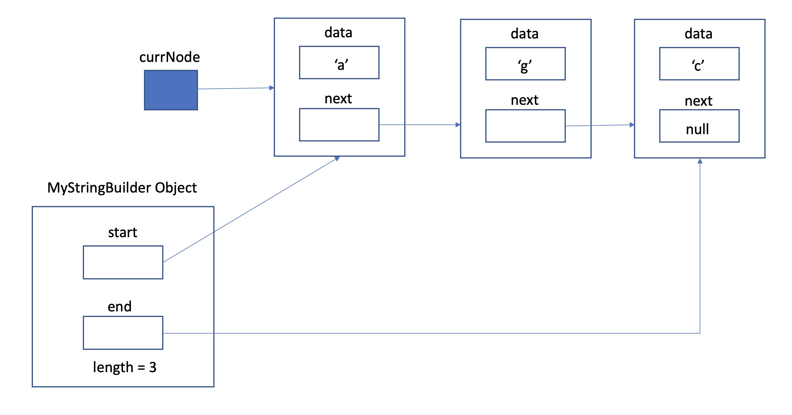

# PA 9: MyStringBuilder
**Due date: Thursday, March 12 @ 11:59PM**

## Introduction
This assignment will require you to build StringBuilder class and its corresponding methods from scratch.
You will also be expected to test your code extensively by writing your own test cases.

## Getting Started
There are a number of ways to get started on development. The following is the recommended way to ensure that your code will compile during grading.

1. If you are using your own machine or are on a lab computer to complete the assignment, go to step 2 directly. Otherwise, ssh into your cs8bwi20 account. 
    - `ssh cs8bwi20__@ieng6.ucsd.edu`
2. Acquire the starter files.
    - From ieng6: 
        - Log in to your cs8bwi20 account. 
        - From the command line, use the command `cp -r ~/../public/pa9 ~/` (this will copy the entire starter files directory to your home directory)
        - Type `ls ~` to verify that you have copied the `pa9` directory over. 
    - From GitHub: 
        - `git clone https://github.com/CaoAssignments/cse8b-wi20-pa9-MyStringBuilder-starter.git`
        - Alternatively, you can download the repo as a zipped folder.
3. If you downloaded the repo as a zipped folder, navigate to it through your terminal or text editor (Atom, Eclipse, etc.). If you git cloned the repo, you can switch into that directory immediately.
    - `cd cse8b-wi20-pa9-MyStringBuilder-starter`
    - Optional: You may choose to rename this repo. You can do this by using this command:
        - `mv cse8b-wi20-pa9-MyStringBuilder-starter pa9`
4. You can now start working on it through vim using the following command or open the directory in your preferred editor.
    - `vim MyStringBuilder.java` or `gvim MyStringBuilder.java`
5. To compile your code, use the `javac` command.
    - Syntax: `javac file1.java file2.java etc...`
    - Example: `javac MyStringBuilder.java`
6. To run your code, use the `java` command passing in the name of the class with the main method that you want to run.
    - Syntax: `java nameOfClass`
    - Example: `java MyStringBuilder`


## MyStringBuilder (MSB)
Strings are implemented differently across different programming languages. In Java, Strings are actual Objects! Furthermore, we have multiple classes which implement sequences of characters in varying ways (char arrays, ArrayLists of Characters, Strings, StringBuilder). These all have similar capabilities with different implementations internally. Here, we now explore one internal implementation by writing a simple string data structure. While it is similar to __the StringBuilder__ class, the internal workings of our StringBuilder will be one we have not seen before. We will call it **MyStringBuilder** to differentiate it from the default Java implementation.

The MyStringBuilder will be used to construct, store, and modify characters in a specific order. Before we talk about how our MyStringBuilder will be implemented, let’s pretend we were using a char array (we won’t use an actual char array in this assignment). In memory, elements of an array are stored next to each other like this:


Suppose we made a mistake with “CSE” and we meant to spell “CASE”. The char array would have {‘C’, ‘S’, ‘E’}. To fix our mistake, we would have to (1) create a new array, (2) move ‘S’ and ‘E’ back, and then (3) assign the letter ‘A’ to position 1. 

1. Create a new array:


2. & 3.  Copy items and add A:


This is inefficient and slow. If the array we are copying is very long, this could take a very long time! In MyStringBuilder, we will instead use **references** to link different letters together. CSE will be represented as `C → S → E`. Let’s think about how we could insert the letter ‘A’ into our MyStringBuilder now.


Nice! We didn’t have to remake our entire MyStringBuilder and copy all of its contents!

But, char is a primitive type and not an Object-subclassed type. Primitive types don’t have the ability to point to each other. To solve this issue, we will contain the char inside a class whose sole purpose is to hold __chars__ and __references to the next char__ in the sequence. We will call this class a ***node***.

**Note**: The diagrams in this writeup are not accurate representations, they are just for you to get a better sense of what is happening - we encourage you to draw your own accurate diagrams/memory models to visualize the logic behind the algorithms. For the diagrams, 
let `start` be the reference to the first CharNode, `end` be the reference to the last CharNode, 
`length` is the length of String, `next` is the next reference in CharNode, 
`data` is the character in CharNode. 



This MyStringBuilder has the word “agc”. Notice that the chars are **not actually inside** **MyStringBuilder** - MyStringBuilder has a reference i.e. `start` which points to the first node, which contains information of a char ‘a’. The first node has a reference `next` that points to another node, which contains information of another char ‘g’. 
Note that `data` and `next` are simply instance variables of type `CharNode`. We can use these to join all of the CharNodes together.
Upon finishing the implementation of MyStringBuilder, the data structure should be able to store infinitely many characters (theoretically). 
Notice that MyStringBuilder has a reference `end` that points to the last node.
You might need to iterate through your MyStringBuilder in order to add and delete characters. To “iterate” through a MyStringBuilder, you need a way to keep track of where your current position. This will be done using an additional CharNode reference (i.e. the `currNode` reference in the figure above). Notice the two references pointing to the first CharNode. 

### Policies
**Use of libraries and other data structures of any kind in this part to store your MyStringBuilder content will result in a zero**. For example, you can’t use a Java StringBuilder to make your MyStringBuilder. Don’t use character arrays, Strings, etc. You **are** allowed to use String's `charAt()`, `substring()`, and `length()` instance methods (you shouldn't need anything else anyway). If you're using CharNodes as specified in the writeup, you're fine. All code must be from scratch and the logic must use only references, object instantiation, and object initialization.

## Exception Handling
In this PA, you will be required to handle different exceptions using **try** and **catch** blocks in your methods. An exception is characterized as anything that disrupts the normal flow of the method. Some examples of different exceptions include NullPointerException, ArithmeticException and IndexOutOfBoundsException. 
You should enclose the part of your code that might cause the error in your try block. In your catch block, make sure you are catching the appropriate exception. You should then throw this exception using the throw keyword. 
Let's take a method attempting to divide by 0 as an example. To handle the exception in the method, you would do the following:
```java
public static void divideByZero() throws ArithmeticException {
  try {
   System.out.println (39/0);
  }
  catch (ArithmeticException e) {
   System.out.println ("Exception caught!");
   throw e;
  }
}
```

## MyException.java and and Its Subclasses
In the starter code, you are provided with four files: **MyException.java**, **MSBOutofBoundsException.java**, **BadInputException.java** and **Constants.java**. Make sure you read through each of the files before starting the assignment. 

### MyException.java
This class extends `Throwable`, which is the superclass of all errors and exceptions. Any MyException object can be thrown using the `throw` keyword, similar to what was shown in the example above.
The constructor takes in two String objects, the first specifying where the MyException object is getting thrown **from** (which method is causing the error), and the second specifying a **message** used to describe the error. 

### MSBOutOfBoundsException.java
This class extends MyException.java. It should be thrown when your MSB object faces an out of bounds error.

### BadInputException.java
This class also extends MyException.java. It should be thrown when the input into the MSB object is of an unintended type (such as a null object).

### The Constructors
You will notice that the constructors for these exceptions takes a `from` String and a `message` String. Use the constants provided
  in Constants.java for the `from` argument and use whatever will help you debug as the `message` argument. 

* The mapping between constants and method signatures is as follows:

| Constant                           | Method Signature (described in further sections)|
| ---------------------------------- |:-----------------------------------------------:|
| FROM_CONSTRUCTOR                   | MyStringBuilder(String str) **[constructor]**   |
| FROM_DEEPCOPY_CONSTRUCTOR          | MyStringBuilder(MyStringBuilder param) **[constructor]**   |
| FROM_APPEND_STR                    | append(String)                                  |
| FROM_INSERT_CHAR                   | insert(char, int)                               |
| FROM_INSERT_STR                    | insert(String, int)                             |
| FROM_FIND_INDEX                    | findIndex(int)                                  |
| FROM_REMOVE                        | remove(int)                                     |
| FROM_DELETE_STARTINDEX             | delete(int)                                     |
| FROM_DELETE_STARTINDEX_ENDINDEX    | delete(int, int)                                |
| FROM_SUBSTRING_STARTINDEX          | substring(int)                                  |
| FROM_SUBSTRING_STARTINDEX_ENDINDEX | substring(int, int)                             |
| FROM_CONCAT                        | concat(MyStringBuilder)                         |

## Defining our two Classes

### Part A: CharNode
`public class CharNode`
This class/file should contain:
* a private char type named `data`, and 
* a private CharNode reference named `next`. 
* one and only public constructor. This takes in one parameter: a char, initializing the instance char letter. It leaves the `next` reference as null.
* Public getters and setters for two instance variables i.e. `getData()`, `getNext()`, `setData()`, `setNext()`. 
**Please make sure that the getters and setters are named as above.**
* Both the instance variables are private, so we must use getters and setters to access them. 

The method signatures for getters and setters are as follows:
- `public char getData()`<br/>
This should return `data`.<br/>

- `public CharNode getNext()`<br/>
This should return `next`.<br/>

Setters are usually void return types but here the setters are returning the objects for the purpose of testing.
- `public CharNode setData(char newData)`<br/>
This should update the `data` to newData and return the CharNode object.<br/>

- `public CharNode setNext(CharNode newNext)`<br/>
This should update the `next` to newNext and return the CharNode object.<br/>

### MyStringBuilder
`public class MyStringBuilder`

Our custom MyStringBuilder class will have 
* three `protected` instance variables: 
  * a reference to our first node (a CharNode). 
  * a reference to our last node (a CharNode). 
  * the length (number of CharNodes) in the current MyStringBuilder
* Three constructors 
  * the first constructor takes a char input and should create a MyStringBuilder with the single CharNode representing the input.
  * the second constructor creates a MyStringBuilder from a String. If the String is null, you should throw a `BadInputException`. If the String is empty, then the constructed MyStringBuilder object should also be empty (have no CharNodes). **Hint**: You should use the `append()` method of Part C for this.
  * the third constructor constructs a MyStringBuilder using a MyStringBuilder object by deep copying its contents. If the MyStringBuilder object is null, you should throw a `BadInputException`. Since CharNodes store their proceeding nodes inside themselves, you should start from the reference to the first charNode and deep copy all charNodes until we get to the end and construct MyStringBuilder object.
 
    For example, consider the following MyStringBuilder in the diagram: `start` points to the charNode with 'r' and `end` points to the charNode with 't'. You should
    traverse from `start` charNode till the `end` charNode and deep copy each charNode i.e. deep copying `data` and `next`.   
    
    

## Methods in MyStringBuilder
These are the following methods that you have to implement in MyStringBuilder.java.
## Part B: Output the Length
### length()
**`public int length()`**

It is useful to know the data structure’s size. One implementation of this would just have us traverse through each node, counting them. However, this is pretty inefficient to do this every time we want to know the length. Therefore, we have the `length` instance variable that will keep track of all changes to the length from other methods. You can therefore directly return the value from that instance variable for this method. 

**Note**: Your other methods must appropriately update the `length` variable each time. 

## Part C: Append
Time to start adding functionality to our MyStringBuilder!
### append()
**`public MyStringBuilder append(char c)`**

This is a helper method used to append a single char to the end of MyStringBuilder. It should be used by the method below, to append an entire string to MyStringBuilder.
* If MyStringBuilder is empty, then `start` and `end` must point to a new CharNode containing this char. 
* Otherwise, use the MyStringBuilder object's end. Recall that the last node’s `next` reference is __always__ null. 
You will make the previously last node point at a newly created CharNode containing `c`. Remember to update the instance variables. If you skipped the second MyStringBuilder constructor, you should revisit it now. 
A fresh MyStringBuilder object `msb`, in a diagram:


if we call `msb.append('a')`, then: 


Afterwards if we call `msb.append(‘b’)`, then:


**`public MyStringBuilder append (String str) throws BadInputException`**

This method should append an entire string to the end of your current MyStringBuilder object. It should then return your new MyStringBuilder object. 
* If the string is empty, nothing should be added to MyStringBuilder.
**This method requires exception handling**. Look at the method header, which throws a BadInputException. What kind of input would you need to handle using this exception (what kind of input is the behavior of this method not defined for)?

## Part D: Output as a String
### toString()
**`public String toString()`**

Since the MSB class is a way to manipulate and store Strings, we should have a `toString()` method which returns an actual `String` object of our stored String. This function accomplishes that goal. Yet, what we currently have is not a char array or a String, but a sequence of nodes of chars. This function takes this sequence of CharNodes and turns the sequence of chars into a `String`. 

## Part E: Insert
## insert()
**`public MyStringBuilder insert (char c, int index) throws MSBOutOfBoundsException`**

This is a helper method that will be used to insert an entire String at a specified index. The method should work as follows:

The `index` is the position in our sequence of nodes where we want to insert a char. Once finished, `c` will have position `index`. The previous node at position `index` will be at position `index + 1`. In fact, all nodes whose positions were `index` or higher will have their positions incremented. Remember to update the instance variables. 

For example, you have a string “rest” and call `insert('e', 3)` on this string. Before `insert()` was called, the letter ‘t’ was at position 3. Now, ‘e’ is at position 3 while ‘t’ is at position 4, resulting in the string “reset”. Note that the node containing ‘s’ must point to a different node now.

Before `insert()`:


After `insert()`:


**Exception Handling:** 
* `index` must be non-negative (0 is not negative) and less than or equal to the length of the sequence. Make sure you handle any invalid input accordingly (by throwing the appropriate exception). (Notice that it is fine if index is equal to the length of the sequence. What does this mean?)

**`public MyStringBuilder insert (String str, int index) throws BadInputException, MSBOutOfBoundsException`**

This method should be similar to your `append()` method. `index` should represent the position in MyStringBuilder where the first character of the `str` should start. You will need to handle invalid input for both the `index` and `str` parameter. If `str` is null, throw `BadInputException` and if `index` is out of bounds, throw `MSBOutOfBoundsException`. 

**Hint**: You might find using your other **insert()** method (the one that takes a char) as a useful subroutine. 

## Part F: Find Character at Index

**`protected CharNode findIndex(int index) throws MSBOutOfBoundsException`**

This method should find the character at a given index. You have to iterate through the CharNodes in MyStringBuilder until `index` is reached. 
* `index` should be non-negative, and `index` should be in the MyStringBuilder (i.e. `length` should be greater than `index`). Be sure to handle any exceptions accordingly.
  * **NOTE** - If MyStringBuilder is empty, then any value of `index` would be out of bounds. 

## Part G: Remove a Char 
### remove()
**`public MyStringBuilder remove (int index) throws MSBOutOfBoundsException`**

This method should remove the CharNode at a given index. Like in `insert()`, index represents the position of the node which we want to remove. After this node is removed, the previous node at position `index + 1` should be at position `index`. Remember to update the instance variables.
* `index` should be **non-negative** and within the length of MyStringBuilder. Make sure you handle any exceptions appropriately.

## Part H: Delete a Range of Chars
### delete()
**`public MyStringBuilder delete (int startIndex) throws MSBOutOfBoundsException`**

This is a method used to delete a range of characters. `startIndex` specifies an index in MyStringBuilder. All nodes starting from and including `startIndex` should be removed from MyStringBuilder. Remember to update the instance variables. 
After delete, the node at `startIndex - 1` should now point to null as its next node.
* The parameter `startIndex` must be nonnegative, and within the bounds of MyStringBuilder. Make sure you handle any exceptions and update instance variables appropriately.
### Examples
Consider the string “abc”. 
* `delete(1)` will delete "bc".
* `delete(2)` will delete ‘c’.
* `delete(0)` will delete the whole sequence.

**`public MyStringBuilder delete (int startIndex, int endIndex) throws BadInputException, MSBOutOfBoundsException`**

This method deletes a subsequence of characters from MyStringBuilder. (Deleting the entire sequence is also considered deleting a subsequence). The nodes for deletion starts at position startIndex and deletes up to, but not including, the node at position `endIndex`.

* If `startIndex == endIndex`, then nothing is deleted. 
* `startIndex` must be within the bounds of MyStringBuilder and non-negative, `endIndex` must be less than or equal to the length of MyStringBuilder. If these are not true, throw an `MSBOutOfBoundsException`. Notice that `endIndex` is allowed to be equal to the length of this MyStringBuilder.
* If `endIndex` is less than `startIndex` throw a `BadInputException`. 

### Examples
Consider the string “abc”. 
* `delete(1,1)` does nothing.
* `delete(1, 2)` will delete ‘b’ and cause the node containing ‘a’ to point at the node containing ‘c’.
* `delete(0, length())`  will delete the whole sequence. When in doubt, draw it out!

## Part I: Get substring
### substring()
**`public String substring(int startIndex) throws MSBOutOfBoundsException`**
This is a method used to get substring starting from `startIndex`. `startIndex` specifies an index in MyStringBuilder. All characters of nodes starting from and including `startIndex` should be concatenated and returned as string.
* The parameter `startIndex` must be nonnegative, and within the bounds of MyStringBuilder. Make sure you handle any exceptions appropriately.
### Examples
Consider the string “abc”. 
* `substring(1)` will return "bc".
* `substring(2)` will return "c".
* `substring(0)` will return "abc".

**`public String substring(int startIndex, int endIndex) throws MSBOutOfBoundsException, BadInputException`**

This method concatenates characters from startIndex to endIndex and returns the substring. 
All nodes starting from and including `startIndex` till `endIndex`, but not including the node at position
 `endIndex` are considered.
* If `startIndex == endIndex`, then empty string is returned. 
* `startIndex` must be within the bounds of MyStringBuilder and non-negative, `endIndex` must be less than or equal to the length of MyStringBuilder. If these are not true, throw an `MSBOutOfBoundsException`. Notice that `endIndex` is allowed to be equal to the length of this MyStringBuilder.
* If `endIndex` is less than `startIndex` throw a `BadInputException`. 

### Examples
Consider the string “abc”. 
* `substring(1,1)` will return an empty string.
* `substring(1, 2)` will return "b".
* `substring(0, length())`  will return "abc"

## Part J: Concat two MSB Objects
### concat()
**`public MyStringBuilder concat(MyStringBuilder rightOperand) throws BadInputException`**

This method concatenates two MSB objects together. `rightOperand` represents the MSB Object that should be the second part of the current MSB object. Remember to update the instance variables. 
* If your current MSB object's length is 0, then your current MSB object will start with the same start node as `rightOperand`. Therefore, it will have the same `start`, `end` and `length` variables as `rightOperand`.
* If `rightOperand` is not a valid input, you need to throw a `BadInputException`.

We now have a working MyStringBuilder! This allows us to manipulate sequences of characters as we please. Make sure to test out your implementation, and then pat yourself on the back.

## Student Satisfaction Survey

Please fill out our [student satisfaction survey](https://docs.google.com/forms/d/1lJG7d1jq6RZTcBBGZJ0AchrN6Mgq_zjiQEfH55CaQms/edit). We are changing how we approach giving assignments and would like to hear about your experiences. After filling out the survey, please write the following sentence at the top of your `README.md` file: **I have completed the student satisfaction survey.** 

## Style
**Make sure you follow the below guidelines for styling since we will be grading you on it.**

We will grade your code style thoroughly. Namely, there are a few things you must have in each file / class / method:

1. File header
2. Class header
3. Method header(s)
4. Inline comments
5. Proper indentation
6. Descriptive variable names
7. No magic numbers
8. Reasonably short methods (if you have implemented each method according to specification in this write-up, you’re fine). This is not enforced as strictly.
9. Lines shorter than 80 characters (keep in mind each tab is equivalent to 8 spaces).
10. Javadoc conventions (@param, @return tags, /** comments */, etc.)

A full [style guideline](https://sites.google.com/eng.ucsd.edu/cse8b-winter2020/style-guide?authuser=0) can be found here. If you need any clarifications, feel free to ask on Piazza.

## Submission
### Submit the following files to Gradescope by Mar 12, Thursday, 11:59pm:
* **CharNode.java**
* **MyStringBuilder.java**
* **BadInputException.java**
* **Constants.java**
* **MSBOutOfBoundsException.java**
* **MyException.java**

**Well done!**
**With that, we have wrapped up the last assignment in Intro to Computer Science: Java II.**
**Congratulations for completing the course assignments and good luck in your future ventures!**
